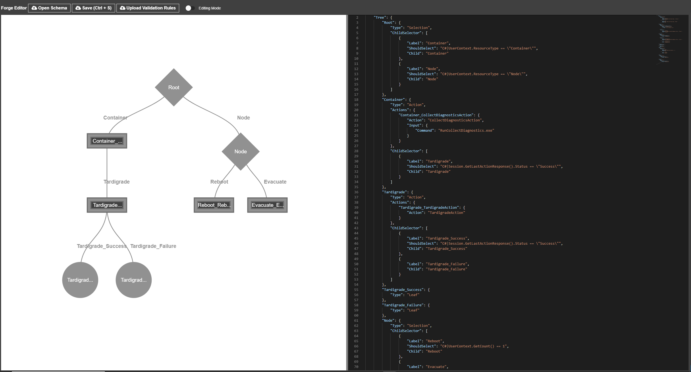

[](https://dev.azure.com/ForgePipeline/Forge/_build/latest?definitionId=1&branchName=master)
		
[Microsoft.Forge.TreeWalker NuGet link](https://www.nuget.org/packages/Microsoft.Forge.TreeWalker/)

_Please use the Issues tab for questions, feature requests, bug reports, etc.. Thank you!_

## What is Forge?
Forge is a generic low-code framework built on a config-driven tree walker. Forge is a great library for developers wanting to build and run their own low-code workflow engine from inside their application.

Similarities to other low-code solutions:
* Walks a decision-tree-like structure that is defined in a JSON config file given by your application.
* Executes actions and can use the results to decide which child node to visit next.
* Edit config files through a UI experience.

Key Differentiators:
* ***Runs directly in your application!*** No need to rely on outside services to run your workflows. Forge is a light-weight library that is easy to import and integrate into your application.

* ***Define your own Actions.*** Forge makes it easy to write simple C# classes that can be executed as Actions from the tree.

* ***Instantiate sessions with different state*** from your application depending on the trigger.

* ***Give Forge scoped access into your application.*** Expose data models, internal classes, service clients, etc. to Forge and then access them directly from the tree.

* ***Roslyn integration*** allows you to replace hardcoded JSON property values in the tree with C# code-snippets. Forge dynamically executes these at runtime to fetch realtime data. For example, fetch data from your application to give as input to an Action.

* ***Calls back to your application with objects from the tree.*** Forge dynamically creates objects defined on the tree and passes them to callbacks and Actions. Callbacks before and after visiting each node provide more places to plug in code.

* ***Built-in persistence interface*** allows tree walker sessions to rehydrate without missing a beat.

* ***Facilitates ecosystem building*** with clearly differentiated contributors: application owner, tree authors, and action authors. Application owners can use Forge to build their own workflow framework for their service. Different teams can then use their framework to author actions and trees.

## Forge components at a high-level
Forge has 3 major components: ForgeTree, TreeWalker, and ForgeEditor.
* **ForgeTree** is the JSON data contract that defines the tree structure. It contains normal tree-concept objects such as TreeNodes and ChildSelectors, as well as TreeActions and other properties.

  _In this example, the Container_TreeNode is an Action type node. It executes a CollectDiagnosticsAction with an Input object containing a Command property. The value of Command is set through a Roslyn expression that calls into the application to get the UserContext.GetCommand() result. In the child selector we see another Roslyn expression that gets the persisted action response, and visits the Tardigrade_TreeNode if the Status is successful._

```yaml
"Container_TreeNode": {
    "Type": "Action",
    "Actions": {
        "Container_TreeAction": {
            "Action": "CollectDiagnosticsAction",
            "Input": {
                "Command": "C#|UserContext.GetCommand()"
            }
        }
    },
    "ChildSelector": [
        {
            "ShouldSelect": "C#|Session.GetLastActionResponse().Status == \"Success\"",
            "Child": "Tardigrade_TreeNode"
        }
    ]
}
```

* **TreeWalker** takes in the ForgeTree and other parameters, and walks the tree to completion. It calls application-defined callbacks and actions, passing in dynamically evaluated properties from the ForgeTree. The TreeWalker makes decisions at runtime about the path it walks by utilizing Roslyn to evaluate C# code-snippets from the ForgeTree.

* **ForgeEditor** is coming to GitHub soon (currently only available internally to Microsoft). ForgeEditor is an Electron application that allows you to visualize and edit the ForgeTree in a clean UI experience. It contains features such as: tree visualization, buttons to create/delete TreeNodes, auto-complete when editing JSON file, text highlighting when hovering over TreeNode, evaluates ForgeSchemaValidationRules while editing, Diagnose mode, etc..



## Advantages of using Forge
* ***Clarity***: Allows users to intuitively walk a visualized tree and understand the workflow logic.
* ***Versatility***: Once you understand the tree, you can easily add or update nodes, actions, child selectors, paths, etc..
* ***Extensibility***: The dynamic objects and properties allow for new functionality to be seamlessly piped into the tree model. For example, adding [rate limits](https://github.com/microsoft/Forge/wiki/Extending-Forge-for-your-Application#RateLimiting) to the BeforeVisitNode callback.
* ***Velocity***: Updating and deploying ForgeTree schema files is much quicker/easier than deploying code. Allows for hot-pushing updates while your application is running. New behaviors that would take weeks to add to legacy codebases turns into minutes/hours with Forge.
* ***Debuggability***: Add logging to the built-in callbacks before and after visiting each node and inside Actions. This allows users to view statistics on their historical data. Statistics can also be viewed in ForgeEditor as a heatmap to highlight "hot" nodes/paths.
* ***Model Verification***: It can be easy to typo an Action name or other property in the ForgeTree since they are JSON strings. To help with that, Forge includes the ForgeSchemaValidationRules.json file containing JSON schema rules for ForgeTrees. These rules can be augmented to contain application-specific properties/values, such as enforcing a set of known ForgeActions and ActionInputs. These rules are used in ForgeEditor to help auto-complete properties and highlight typos.
* ***Stateful (optional)***: The IForgeDictionary is used to cache state while Forge walks the tree. This can be implemented by the application to be stateful if desired, but a Dictionary implementation is built-in. This allows applications to pick up where they left off after a failover.

## User Story: Azure-Compute Repair Manager
Microsoft Azure-Compute's repair manager service is backed by Forge. Fault information is passed to the TreeWalker and a ForgeTree schema is walked. Depending on the type of fault and a handful of other checks, TreeWalker may attempt in-place recovery actions. If these actions were unsuccessful in mitigating the issue, diagnostics are collected and Tardigrade may be performed. You can read more about Azure’s recovery workflow in this blogpost: https://azure.microsoft.com/en-us/blog/improving-azure-virtual-machines-resiliency-with-project-tardigrade/

*"The biggest (and unexpected) benefit of using Forge has been the democratization of contributors and the velocity of pushing updates. It used to take weeks to implement new features on the old service, and very few engineers had the expertise to make such changes. Since moving our repair workflows to Forge, new features/behaviors/paths are often added by teams that request them. This is possible because of the clarity that visualizing the tree brings. After initial ramp-up time, new contributors are then able to send code reviews out for changes within a day. They also basically become experts themselves and help onboard their teammates. It's magical! A cross-team ecosystem has been organically created and folks are eager to contribute."*

## Further Reading
Check out the [Wiki](https://github.com/microsoft/Forge/wiki) pages for a deeper dive into Forge, as well as How-To guides!

For more high-level overview details, check out the [ForgeOverview](https://github.com/microsoft/Forge/wiki/ForgeOverview) page.

Ready to get hands-on experience with Forge? Check out the [Forge QuickStart Guide](https://github.com/microsoft/Forge/wiki/Forge-QuickStart-Guide) page.

Ready to dig a bit deeper? Check out the "How To:" guides for in-depth details for each group of contributors:
* Application owner - [How To: Use Forge in my Application](https://github.com/microsoft/Forge/wiki/How-To:-Use-Forge-in-my-Application) and [How To: Extend Forge in my Application](https://github.com/microsoft/Forge/wiki/How-To:-Extend-Forge-in-my-Application)
* ForgeTree author - [How To: Author a ForgeTree](https://github.com/microsoft/Forge/wiki/How-To:-Author-a-ForgeTree)
* ForgeAction author - [How To: Author a ForgeAction](https://github.com/microsoft/Forge/wiki/How-To:-Author-a-ForgeAction)

## Contributing
Interested in contributing to Forge? Check out the [Contributing](CONTRIBUTING.md) page for details.

## License
Copyright (c) Microsoft Corporation. All rights reserved.

Licensed under the [MIT](LICENSE.txt) license.
